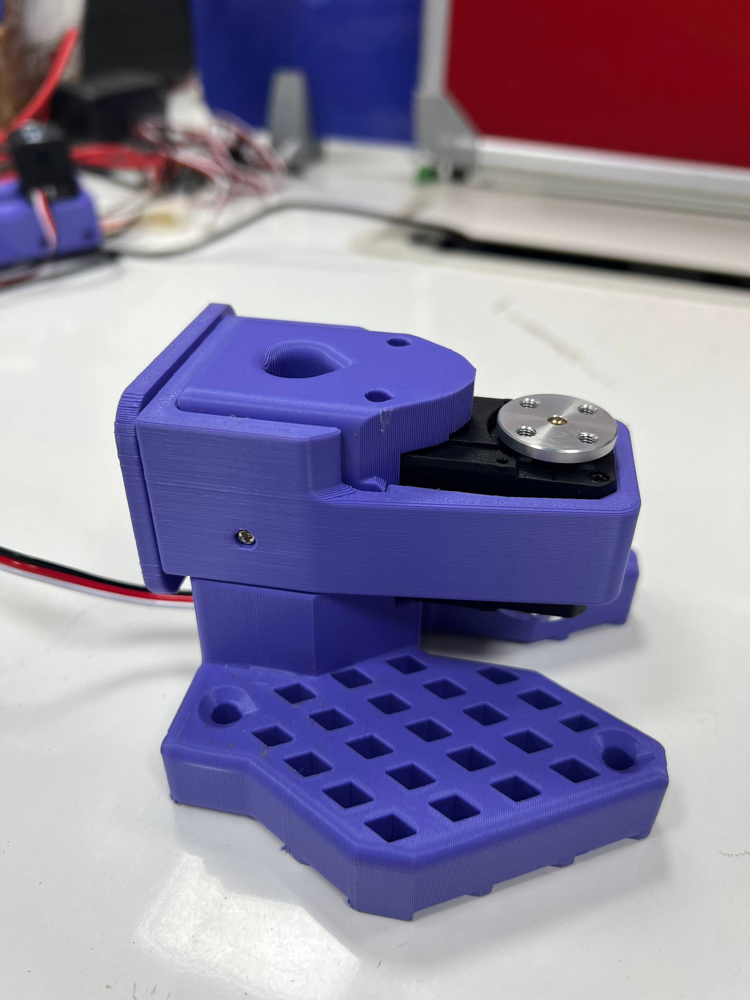
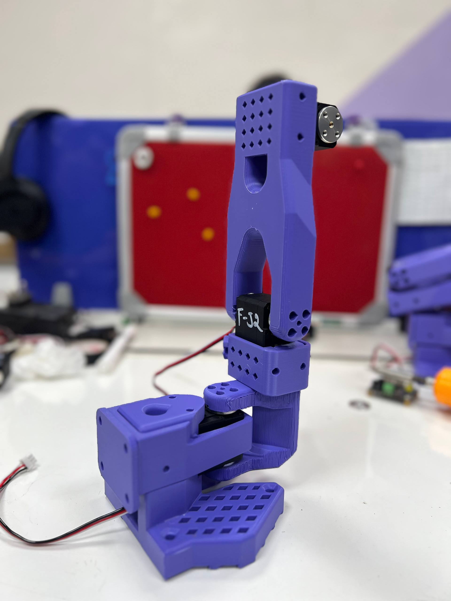
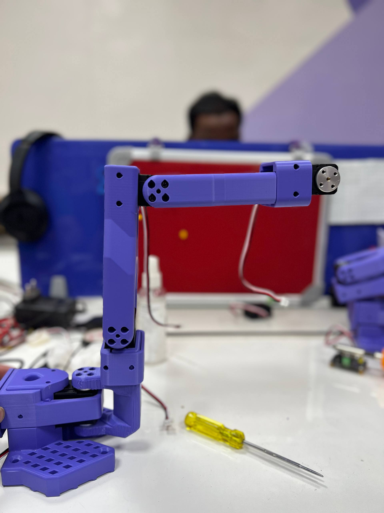
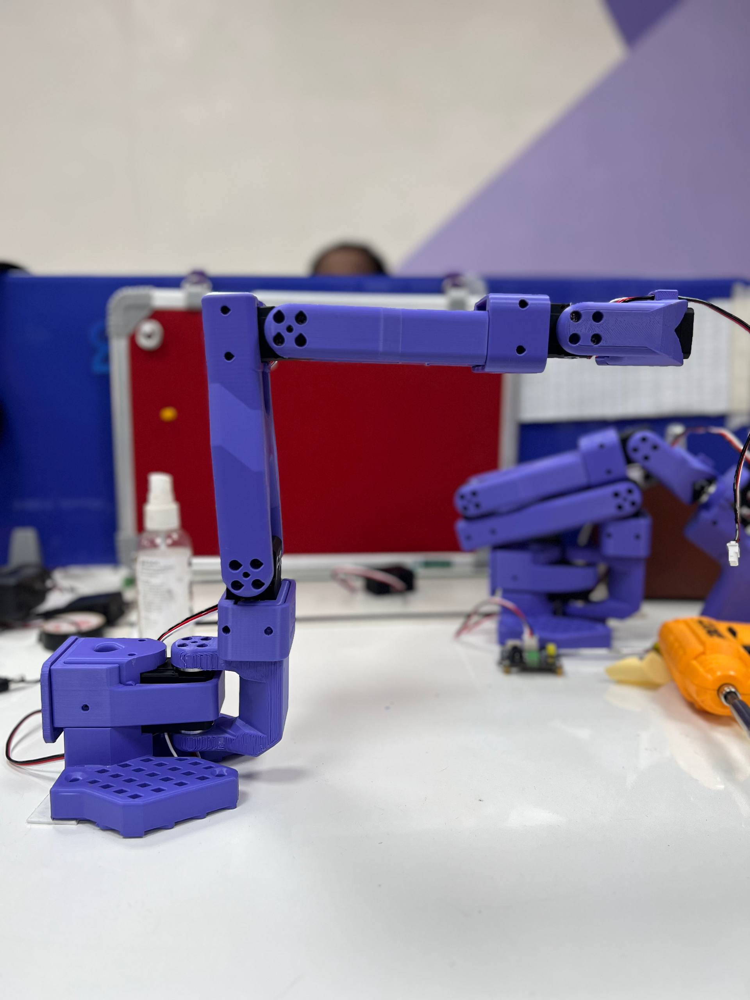
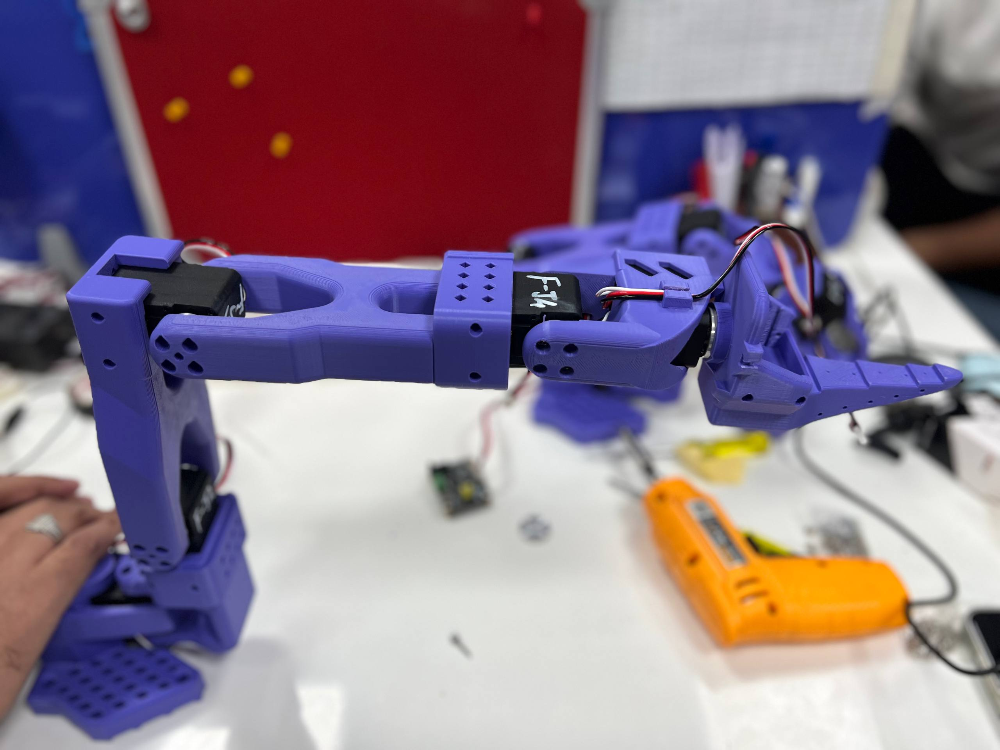
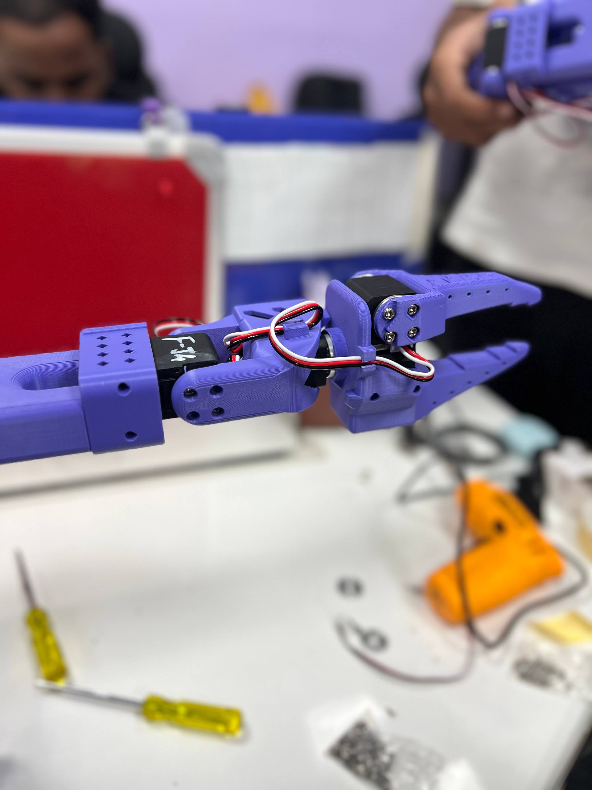
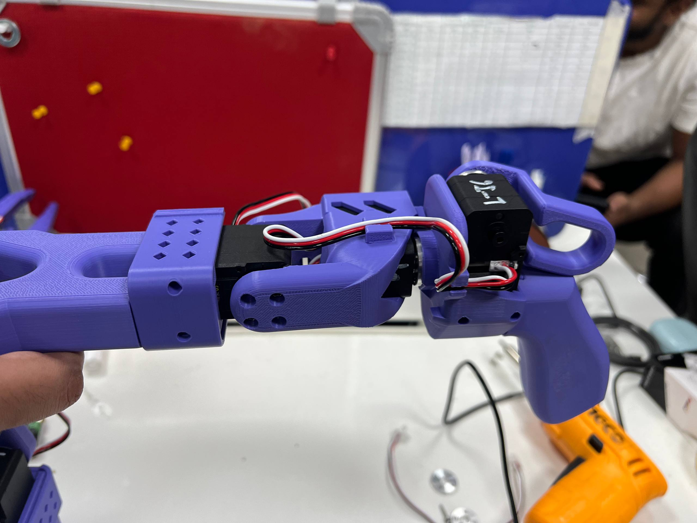
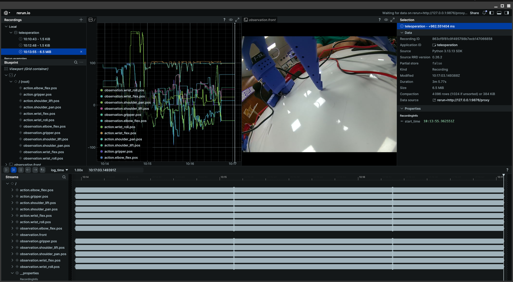

# SO-101 Arm — Setup & Teleoperation Guide

<p align="center">
  <a href="#1-overview">Overview</a> •
  <a href="#2-prerequisites">Prerequisites</a> •
  <a href="#3-motor-id-programming">Motor ID Programming</a> •
  <a href="#4-assembly-at-neutral-positions">Assembly at Neutral Positions</a> •
  <a href="#5-calibration">Calibration</a> •
  <a href="#6-teleoperation">Teleoperation</a> •
  <a href="#7-adding-a-camera">Adding a Camera</a> •
  <a href="#8-troubleshooting">Troubleshooting</a>
</p>

---

## 1. Overview

The **SO-101** is a 6-DOF desktop robot arm built around the Feetech STS3215 servo motor. This guide covers the complete workflow to go from unassembled hardware to a fully functional bilateral teleoperation system using two arms (a **leader** and a **follower**).

### Joint Map

| Joint # | Motor Name     | ID  | Role                         |
|:-------:|:---------------|:---:|:-----------------------------|
| 1       | shoulder_pan   | 1   | Base rotation (left/right)   |
| 2       | shoulder_lift  | 2   | Shoulder pitch (up/down)     |
| 3       | elbow_flex     | 3   | Elbow bend                   |
| 4       | wrist_flex     | 4   | Wrist pitch                  |
| 5       | wrist_roll     | 5   | Wrist rotation               |
| 6       | gripper        | 6   | Gripper open/close           |

### Hardware Overview

| Component         | Leader Arm              | Follower Arm            |
|:------------------|:------------------------|:------------------------|
| Controller Board  | Feetech serial board    | Feetech serial board    |
| USB Port          | `/dev/ttyACM1`          | `/dev/ttyACM0`          |
| Power Supply      | 5 V external PSU        | 5 V external PSU        |
| Motors            | 6 × Feetech STS3215     | 6 × Feetech STS3215     |

> **Note:** Your actual ports (`/dev/ttyACM0`, `/dev/ttyACM1`) may differ.
> Run `uv run lerobot-find-port` to identify each arm's port after connecting the bus adapter.

---

### Motor Specifications — Leader Arm

The leader arm uses lighter, faster motors since it only needs to sense and transmit joint positions (no payload to carry).

| Joint # | Motor Name    | Model           | Gear Ratio | Stall Torque | Operating Voltage | Encoder   |
|:-------:|:--------------|:----------------|:----------:|:------------:|:-----------------:|:---------:|
| 1       | shoulder_pan  | STS3215-**C046** | 1 : 147   | ~14.4 kg·cm  | 5 V               | 12-bit    |
| 2       | shoulder_lift | STS3215-**C001** | 1 : 345   | ~19 kg·cm    | 5 V               | 12-bit    |
| 3       | elbow_flex    | STS3215-**C046** | 1 : 147   | ~14.4 kg·cm  | 5 V               | 12-bit    |
| 4       | wrist_flex    | STS3215-**C046** | 1 : 147   | ~14.4 kg·cm  | 5 V               | 12-bit    |
| 5       | wrist_roll    | STS3215-**C046** | 1 : 147   | ~14.4 kg·cm  | 5 V               | 12-bit    |
| 6       | gripper       | STS3215-**C046** | 1 : 147   | ~14.4 kg·cm  | 5 V               | 12-bit    |

> **Note:** J2 (`shoulder_lift`) uses the higher-torque **C001** variant (1:345 gear ratio) because the shoulder lift joint bears the most static load even on the leader arm.

---

### Motor Specifications — Follower Arm

The follower arm uses the **C018** variant across all 6 joints. This variant shares the same high gear ratio (1:345) as the C001 but is rated for 5V operation, providing substantially more holding torque to carry objects and resist gravity during task execution.

| Joint # | Motor Name    | Model           | Gear Ratio | Stall Torque | Operating Voltage | Encoder   |
|:-------:|:--------------|:----------------|:----------:|:------------:|:-----------------:|:---------:|
| 1       | shoulder_pan  | STS3215-**C018** | 1 : 345   | ~30 kg·cm    | 5 V               | 12-bit    |
| 2       | shoulder_lift | STS3215-**C018** | 1 : 345   | ~30 kg·cm    | 5 V               | 12-bit    |
| 3       | elbow_flex    | STS3215-**C018** | 1 : 345   | ~30 kg·cm    | 5 V               | 12-bit    |
| 4       | wrist_flex    | STS3215-**C018** | 1 : 345   | ~30 kg·cm    | 5 V               | 12-bit    |
| 5       | wrist_roll    | STS3215-**C018** | 1 : 345   | ~30 kg·cm    | 5 V               | 12-bit    |
| 6       | gripper       | STS3215-**C018** | 1 : 345   | ~30 kg·cm    | 5 V               | 12-bit    |

> **Common specs across all variants:** TTL serial bus (half-duplex), 1 Mbps baud rate, 4096 steps/360° resolution, metal gears (backlash ≤ 0.5°), dimensions 45.2 × 24.7 × 35 mm, weight ~55 g.

> [!CAUTION]
> **Do not mix C018 and C046 motors** on the same arm without updating the calibration. The gear ratio difference (1:345 vs 1:147) means an identical encoder movement produces a different physical joint angle on each variant.

---

## 2. Prerequisites

### 2.1 System Requirements

| Requirement     | Minimum Version |
|:----------------|:----------------|
| Python          | 3.12 or later   |
| Git             | Any recent version |
| OS              | Ubuntu 22.04 / Linux (tested) |
| USB serial port | `/dev/ttyACM*` (bus adapter) |

### 2.2 Install `uv` (Package Manager)

LeRobot uses `uv` as its package manager. Install it if not already present:

```bash
curl -LsSf https://astral.sh/uv/install.sh | sh
source $HOME/.cargo/env   # or restart your terminal
```

Verify the installation:
```bash
uv --version
```

### 2.3 USB Serial Port Access (Linux)

On Linux, your user must be in the `dialout` group to access `/dev/ttyACM*` serial ports without `sudo`:

```bash
sudo usermod -aG dialout $USER
```

> [!IMPORTANT]
> **Log out and log back in** (or reboot) after running this command for the group change to take effect. Without this, all motor bus commands will fail with a `Permission denied` error.

### 2.4 Install LeRobot

Clone the repository and install the base dependencies with Feetech motor support:

```bash
git clone https://github.com/rigbetellabs/lerobot.git
cd lerobot

# Base install — motor control, calibration, teleoperation
uv sync --locked --extra feetech
```

### 2.5 Install Visualization Support (Optional but Recommended)

The `--display_data=true` flag on the teleoperate command requires the `rerun-sdk` visualization library. Install it together with the Feetech extra to avoid dependency conflicts:

```bash
# Install both together — installing viz alone will remove feetech dependencies
uv sync --locked --extra feetech --extra viz
```

> [!WARNING]
> **Do not run `uv sync --extra viz` alone** after already installing Feetech. The `uv sync` command resolves a fresh lockfile and will remove previously installed extras. Always specify all required extras together in a single command.

### 2.6 Camera Support (Optional)

Camera capture via OpenCV is included in the base dependencies (`opencv-python-headless` is a core dependency). No additional install is needed for USB webcams.

If you plan to use an **Intel RealSense** depth camera, install the RealSense extra:

```bash
uv sync --locked --extra feetech --extra viz --extra intelrealsense
```

### 2.7 Copy the Assembly Helper Script

The `set_middle_positions.py` script (included in this repository) is used to program motor IDs and center each joint before assembly. No additional install is required — it uses the same `feetech` extra installed above.

### 2.8 Find Serial Ports

Connect the bus adapter for one arm at a time (the arm does not need to be assembled — only the controller board needs to be connected via USB), then run:

```bash
uv run lerobot-find-port
```

Note the port printed (e.g. `/dev/ttyACM0`) for the connected bus adapter, then connect the second arm's bus adapter and repeat.

---

## 3. Motor ID Programming

Every motor ships from the factory with **ID = 1** and default baud rate. Before assembly, each motor must be programmed with its unique ID (1–6) so the controller can address them individually.

> [!CAUTION]
> **Connect only ONE motor at a time** when programming IDs. If multiple motors share the same ID on the same bus simultaneously, the communication protocol will fail and you will corrupt addresses on multiple motors at once.

### 3.1 Program a Single Motor's ID

Connect only the target motor's cable, then run:

```bash
# Example: program the elbow_flex motor (ID 3) on the leader arm
uv run python set_middle_positions.py --port /dev/ttyACM1 --id 3
```

The script will:
1. Scan across all standard baud rates to find the connected motor.
2. Reprogram the baud rate to `1,000,000` if it is not already set.
3. Write the target ID into the motor's EEPROM.
4. Move the motor to its neutral middle position (`2047`).

### 3.2 ID Reference

Repeat the above for all 6 motors on each arm:

```bash
# Leader arm (replace /dev/ttyACM1 with your actual port)
uv run python set_middle_positions.py --port /dev/ttyACM1 --id 1  # shoulder_pan - motor 0
uv run python set_middle_positions.py --port /dev/ttyACM1 --id 2  # shoulder_lift - motor 1
uv run python set_middle_positions.py --port /dev/ttyACM1 --id 3  # elbow_flex - motor 2
uv run python set_middle_positions.py --port /dev/ttyACM1 --id 4  # wrist_flex - motor 3
uv run python set_middle_positions.py --port /dev/ttyACM1 --id 5  # wrist_roll - motor 4
uv run python set_middle_positions.py --port /dev/ttyACM1 --id 6  # gripper - motor 5

# Follower arm (replace /dev/ttyACM0 with your actual port)
uv run python set_middle_positions.py --port /dev/ttyACM0 --id 1  # shoulder_pan - motor 0
uv run python set_middle_positions.py --port /dev/ttyACM0 --id 2  # shoulder_lift - motor 1
uv run python set_middle_positions.py --port /dev/ttyACM0 --id 3  # elbow_flex - motor 2
uv run python set_middle_positions.py --port /dev/ttyACM0 --id 4  # wrist_flex - motor 3
uv run python set_middle_positions.py --port /dev/ttyACM0 --id 5  # wrist_roll - motor 4
uv run python set_middle_positions.py --port /dev/ttyACM0 --id 6  # gripper - motor 5
```

### 3.3 Replacing a Single Motor

If you physically replace one motor (e.g. the elbow flexor), run only the script for that specific ID with only the new motor connected:

```bash
uv run python set_middle_positions.py --port /dev/ttyACM1 --id 3
```

---

## 4. Assembly at Neutral Positions

Before attaching the structural arm links (horns, brackets, connectors), every motor **must be set to its encoder midpoint (~2047)** first. This ensures all joints are physically at 0° when the calibration defines them as 0°, giving the arm the maximum symmetrical range of motion in both directions.

> [!IMPORTANT]
> **Never attach a joint link to a motor that is not at its midpoint.** If the horn is attached at the wrong angle, the arm's software range will be mechanically offset and the arm may damage itself during teleoperation or policy rollout.

### Procedure (Per Motor)

1. Run the helper for the target motor ID. The motor will spin to `2047` and hold.
2. With the motor **holding torque**, slide the structural link or horn onto the spline shaft.
3. Align the link so the arm is at its natural resting position (vertical / flat / straight) at this angle.
4. Tighten the set screw or push-fit horn to lock the angle.
5. Press **Enter** in the terminal.

```bash
# Run all 6 motors sequentially on the leader
uv run python set_middle_positions.py --port /dev/ttyACM1

# Or run a specific motor only
uv run python set_middle_positions.py --port /dev/ttyACM1 --id 4
```

> [!WARNING]
> **Overload Error during assembly:** If the motor is mechanically blocked and cannot reach `2047`, the firmware will trigger an Overload protection flag and stop responding.
> To recover: **power-cycle the arm** (turn off/on the 5V supply) and retry after clearing the mechanical obstruction.

---

### Follower Arm — Joint Assembly Photos

The following images show the correct neutral position for each joint of the **follower arm** at encoder midpoint (~2047) before locking the horn.

| Joint | Motor Name    | Assembly Reference |
|:-----:|:--------------|:-------------------|
| J1    | shoulder_pan  |  |
| J2    | shoulder_lift |  |
| J3    | elbow_flex    |  |
| J4    | wrist_flex    |  |
| J5    | wrist_roll    |  |
| J6    | gripper       |  |

---

### Leader Arm — Joint Assembly Photos

For the leader arm, **J1–J5 assembly is identical to the follower arm** (refer to the table above). Only the gripper (J6) differs due to a different motor variant:

| Joint | Motor Name | Assembly Reference |
|:-----:|:-----------|:-------------------|
| J6    | gripper    |  |

---

## 5. Calibration

Calibration records the real encoder `range_min` and `range_max` for each joint as you manually move the arm through its full range of motion. The result is saved as a JSON file (`my_leader.json` / `my_follower.json`) and used at runtime to normalize motor positions to degrees.

> [!CAUTION]
> **Do not force the arm past its natural mechanical stop.** Moving a joint beyond its physical limit during calibration risks stripping the gearbox and is irreversible.

### 5.1 Calibrate the Leader Arm

```bash
uv run lerobot-calibrate \
    --teleop.type=so101_leader \
    --teleop.port=/dev/ttyACM1 \
    --teleop.id=my_leader
```

Follow the on-screen prompts. The GUI will guide you through each joint:
1. Move the joint to its **minimum** angle and hold.
2. Press the button in the calibration GUI to record the minimum.
3. Move the joint to its **maximum** angle and hold.
4. Press the button to record the maximum.
5. Repeat for each joint until all 6 are done.

### 5.2 Calibrate the Follower Arm

```bash
uv run lerobot-calibrate \
    --robot.type=so101_follower \
    --robot.port=/dev/ttyACM0 \
    --robot.id=my_follower
```

> [!NOTE]
> **Recalibrate whenever a motor is replaced.** Swapping a physical servo motor resets its internal homing offset register. Running calibration again generates a fresh `my_follower.json` that accurately reflects the new motor's neutral position.

### 5.3 Elbow Joint Calibration Note

The elbow joint can sometimes reach encoder value `0` (the absolute hardware minimum of the 12-bit encoder) when fully extended. If `range_min` records as `0`, leave a small physical margin (stop just before the hard mechanical limit) to prevent the arm from grinding against its own stop during teleoperation.

---

## 6. Teleoperation

With both arms calibrated and all motor IDs programmed, you can begin leader-follower teleoperation.

> [!IMPORTANT]
> **External 5V power supply must be ON** for both arms before running any teleoperation command. The Feetech STS3215 motors cannot operate on USB bus power alone. Ensure the external 5V PSU is connected to the controller board and switched on. Running without it will cause `Input voltage error` faults on every motor.

### 6.1 Basic Teleoperation

```bash
uv run lerobot-teleoperate \
    --robot.type=so101_follower \
    --robot.port=/dev/ttyACM0 \
    --robot.id=my_follower \
    --teleop.type=so101_leader \
    --teleop.port=/dev/ttyACM1 \
    --teleop.id=my_leader
```

### 6.2 Teleoperation with Live Data Display

Add `--display_data=true` to open a **Rerun** visualization window showing live joint positions being sent from the leader to the follower in real time:

```bash
uv run lerobot-teleoperate \
    --robot.type=so101_follower \
    --robot.port=/dev/ttyACM0 \
    --robot.id=my_follower \
    --teleop.type=so101_leader \
    --teleop.port=/dev/ttyACM1 \
    --teleop.id=my_leader \
    --display_data=true
```

If `rerun-sdk` is not installed, install it first:

```bash
uv sync --extra feetech --extra viz
```

**Rerun Visualization Window:**



### 6.3 Calibration Mismatch Prompt

If you replaced a motor since the last calibration, the script will display:

```
Mismatch between calibration values in the motor and the calibration file...
Press ENTER to use provided calibration file, or type 'c' and press ENTER to run calibration:
```

Type **`c`** and press **Enter** to re-run calibration inline. This is equivalent to running `lerobot-calibrate` separately.

---

## 7. Adding a Camera

A USB camera mounted on the follower arm provides a first-person visual feed during teleoperation. The camera used on the follower arm is the **Waveshare IMX335 5MP USB Camera — Model (B)**.

| Specification      | Value                                        |
|:-------------------|:---------------------------------------------|
| Model              | Waveshare IMX335-5MP-USBC-B                  |
| Image Sensor       | Sony IMX335                                  |
| Sensor Size        | 1/2.8"                                       |
| Max Resolution     | 2592 × 1944 (5 MP)                           |
| Frame Rates        | 2592×1944 @ 30 FPS · 1920×1080 @ 30 FPS · 1280×720 @ 30 FPS |
| Field of View      | 175° (Diagonal) — Ultra-wide angle           |
| Focus              | Fixed Focus                                  |
| Aperture           | F2.0                                         |
| Interface          | USB 2.0 (UVC, plug-and-play)                 |
| Supported Formats  | MJPG, YUY2                                   |
| Extra Features     | Wide Dynamic Range (WDR), Built-in microphone |
| Linux Device       | `/dev/video3` (verified)                     |
| Used Resolution    | 640 × 480 @ 30 FPS (MJPG)                   |

> **Note:** The Model (B) is plug-and-play on Linux — no driver installation required. The 175° ultra-wide FOV captures the full arm workspace from a close-mount position.

---

### 7.2 Find Camera Index

To confirm your camera's device index:

```bash
uv run lerobot-find-cameras
```

Or verify with ffplay (uses MJPEG format for better USB bandwidth efficiency):

```bash
ffplay -f v4l2 -input_format mjpeg -video_size 640x480 /dev/video3
```

### 7.3 Teleoperation with Camera Feed

```bash
uv run lerobot-teleoperate \
    --robot.type=so101_follower \
    --robot.port=/dev/ttyACM0 \
    --robot.id=my_follower \
    --teleop.type=so101_leader \
    --teleop.port=/dev/ttyACM1 \
    --teleop.id=my_leader \
    --robot.cameras="{front: {type: opencv, index_or_path: 3, width: 640, height: 480, fps: 30, fourcc: MJPG}}" \
    --display_data=true
```

> [!TIP]
> If you get a black frame or the camera fails to open, try using the full device path instead of the index:
> ```bash
> --robot.cameras="{front: {type: opencv, index_or_path: /dev/video3, width: 640, height: 480, fps: 30, fourcc: MJPG}}"
> ```

> [!CAUTION]
> **Fix the camera mount before starting.** The camera position and angle must remain identical between sessions. Any change in camera viewpoint will affect the consistency of your visual observations.


## 8. Troubleshooting

### `Input voltage error` on any motor

**Cause:** The external power supply is off, disconnected, or providing insufficient current.

**Fix:**
1. Verify the **5V external PSU** is plugged into the controller board and the wall outlet, and the power switch is **ON**.
2. Check that all daisy-chain cables between motors are fully seated.
3. Power-cycle the arm (turn off, wait 2 seconds, turn on) to clear the fault flag.
4. Re-run your command.

---

### `Overload error` on a motor

**Cause:** The motor drove into a mechanical hard stop or was blocked and overloaded its own current limit.

**Fix:**
1. Manually relieve the mechanical obstruction (move the joint by hand away from the hard stop).
2. Power-cycle the arm to clear the Overload protection flag.
3. Re-run your command.

---

### `There is no status packet!` (Communication failure)

**Cause:** A motor on the bus lost power or its cable disconnected mid-operation, breaking all communication on the shared daisy-chain.

**Fix:**
1. Check all daisy-chain JST cables for loose connections.
2. Check the connector on the motor where the error was reported (last ID before the break in the chain).
3. Power-cycle and re-run.

---

### Motor not found by `set_middle_positions.py`

**Cause:** Either the cable is not connected, or the motor is already in Overload/fault state.

**Fix:**
1. Ensure the cable is firmly inserted into the motor socket.
2. Power-cycle the arm.
3. Confirm you are using the correct `--port` for the connected arm.

---

### Calibration mismatch on startup

**Cause:** A motor was replaced, repositioned, or the arm was reassembled since the last calibration run.

**Fix:** Re-run calibration:
```bash
uv run lerobot-calibrate \
    --robot.type=so101_follower \
    --robot.port=/dev/ttyACM0 \
    --robot.id=my_follower
```

---

### `invalid choice: 'so101_follower'` with `--teleop.type`

**Cause:** Leader types (`so101_leader`) must use `--teleop.*` flags. Follower types (`so101_follower`) must use `--robot.*` flags.

| Hardware    | Correct Prefix |
|:------------|:---------------|
| Leader arm  | `--teleop.type=so101_leader` |
| Follower arm| `--robot.type=so101_follower` |

---

## Quick Reference Command Cheat Sheet

```bash
# Find ports
uv run lerobot-find-port

# Program a motor's ID (connect only that motor first!)
uv run python set_middle_positions.py --port /dev/ttyACM1 --id <1-6>

# Setup motor IDs via official tool (leader)
uv run lerobot-setup-motors --teleop.type=so101_leader --teleop.port=/dev/ttyACM1

# Calibrate leader
uv run lerobot-calibrate --teleop.type=so101_leader --teleop.port=/dev/ttyACM1 --teleop.id=my_leader

# Calibrate follower
uv run lerobot-calibrate --robot.type=so101_follower --robot.port=/dev/ttyACM0 --robot.id=my_follower

# Teleoperate (no camera)
uv run lerobot-teleoperate \
    --robot.type=so101_follower --robot.port=/dev/ttyACM0 --robot.id=my_follower \
    --teleop.type=so101_leader --teleop.port=/dev/ttyACM1 --teleop.id=my_leader

# Teleoperate with camera + live display
uv run lerobot-teleoperate \
    --robot.type=so101_follower --robot.port=/dev/ttyACM0 --robot.id=my_follower \
    --teleop.type=so101_leader --teleop.port=/dev/ttyACM1 --teleop.id=my_leader \
    --robot.cameras="{front: {type: opencv, index_or_path: 3, width: 640, height: 480, fps: 30, fourcc: MJPG}}" \
    --display_data=true
```

---

<p align="center">
  Designed, assembled, and maintained by the team at<br/><br/>
  <strong>RigBetel Labs LLP®</strong><br/>
  Charholi Bk., via. Loheagaon, Pune – 412105, MH, India 🇮🇳<br/><br/>
  🌐 <a href="https://rigbetellabs.com">RigBetelLabs.com</a> &nbsp;|&nbsp;
  📞 <a href="https://wa.me/918432152998">+91-8432152998</a> &nbsp;|&nbsp;
  📨 <a href="mailto:info@rigbetellabs.com">info@rigbetellabs.com</a><br/><br/>
  <a href="http://linkedin.com/company/rigbetellabs/">LinkedIn</a> &nbsp;|&nbsp;
  <a href="http://instagram.com/rigbetellabs/">Instagram</a> &nbsp;|&nbsp;
  <a href="http://facebook.com/rigbetellabs">Facebook</a> &nbsp;|&nbsp;
  <a href="http://twitter.com/rigbetellabs">Twitter</a> &nbsp;|&nbsp;
  <a href="https://www.youtube.com/channel/UCfIX89y8OvDIbEFZAAciHEA">YouTube</a> &nbsp;|&nbsp;
  <a href="https://discord.gg/qDuCSMTjvN">Discord</a>
</p>
